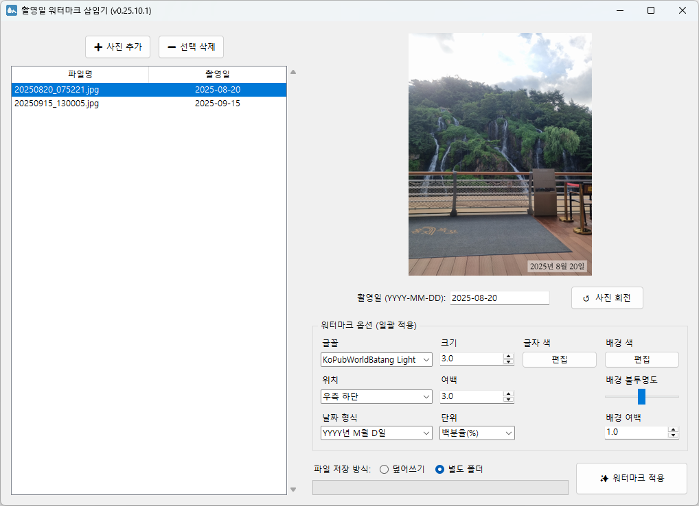

# 📸 촬영일 워터마크 삽입기

사진의 EXIF 정보에서 원본 촬영일을 자동으로 읽어들이고 워터마크로 추가할 수 있는 데스크톱 애플리케이션입니다. 여러 장의 사진을 한 번에 처리하고, 다양한 옵션을 통해 워터마크 스타일을 변경할 수도 있습니다.



---

## ✨ 주요 기능 (Features)

- **일괄 처리**
    - 여러 장의 사진을 목록에 추가하여 한 번에 워터마크를 적용할 수 있습니다.
- **날짜 자동 추출**
    - 사진을 추가할 때 EXIF 데이터를 통하여 촬영일을 추출합니다.
    - 가장 신뢰도가 높은 원본 촬영일(`DateTimeOriginal`) 값부터 우선적으로 탐색합니다.
- **실시간 미리보기**
    - 워터마크 옵션 변경 시 적용되는 모습을 실시간으로 미리보기 창에 반영합니다.
- **워터마크 커스터마이징**
    - **글자:** 시스템에 설치된 글꼴, 크기(px 또는 %), 글자 색, 날짜 표시 형식
    - **배경:** 배경 색, 투명도, 글자 주변 배경 여백(padding)
    - **위치:** 좌측 상단, 우측 하단 등 5가지 위치 및 이미지 경계로부터의 여백(margin)
- **유연한 파일 저장**
    - 원본 파일을 덮어쓰거나, 사용자 지정 경로에 안전하게 사본을 저장할 수 있습니다.
- **개별 파일 수정**
    - 목록에서 특정 사진의 촬영일을 직접 수정하거나, 이미지를 90도 단위로 회전할 수 있습니다.
- **설정 저장**
    - 마지막으로 사용한 워터마크 옵션은 `settings.json` 파일에 자동 저장되고 다음 실행 시 그대로 불러옵니다.

---

## 🛠️ 설치 및 실행 (Installation & Usage)

### 요구 사항

- 개발 및 테스트 환경에서의 Python 버전은 3.13입니다.
- 필요 라이브러리: `Pillow`, `matplotlib`
- Macintosh 등 특정 환경에서는 아이콘 표시 등 일부 기능이 제대로 동작하지 않을 수 있습니다.

### 설치 방법

1.  저장소를 클론하거나 다운로드합니다.
2.  터미널 또는 명령 프롬프트에서 아래 명령어를 실행하여 필요 라이브러리를 설치합니다.
    ```bash
    pip install Pillow matplotlib
    ```

### 실행 방법

1.  터미널에서 아래 명령어를 입력하여 애플리케이션을 실행합니다.
    ```bash
    python WatermarkApp.py
    ```
2.  **➕ 사진 추가** 버튼을 눌러 워터마크를 추가할 이미지 파일들을 불러옵니다.
3.  목록에서 파일을 선택해 미리보기를 확인하고, 출력할 날짜와 워터마크 스타일을 원하는 대로 수정합니다.
4.  **파일 저장 방식**을 선택한 후 **✨ 워터마크 적용** 버튼을 누르면 작업이 시작됩니다.

---

## 💬 자주 묻는 질문 (FAQ)

- **워터마크에서 숫자는 괜찮은데 한글이 깨져서 나와요.**
    - 날짜 형식에 한글이 포함되어 있을 때, 현재 선택된 글꼴이 한글을 지원하지 않는다면 그 부분이 제대로 출력되지 않는 현상이 발생할 수 있습니다. 해당 글꼴의 문제이므로 한글을 지원하는 다른 글꼴로 바꿔 적용해 보세요.

- **워터마크 옵션에서, 제 마음에 드는 글꼴이 없어요.**
    - 현재 사용 중인 시스템에 설치되어 있는 글꼴만 사용할 수 있습니다.

- **워터마크 옵션에서, 한글 글꼴(예: 굴림/바탕/맑은 고딕)을 찾을 수 없어요.**
    - 영문명 기준으로 찾아 보세요. 예를 들어 굴림은 Gulim, 바탕은 Batang, 맑은 고딕은 Malgun Gothic입니다.

- **설치 방법을 봐도 무슨 말인지 모르겠어요. 그냥 알아서 설치해 주는 파일은 없나요?**
    - 추후 누구나 쉽게 설치 및 사용할 수 있도록 패키지 형태로 만들어 배포할 예정입니다.

- **사용 중 버그를 발견했어요.**
    - 버그가 있다면 언제든지 제보해 주세요. 최대한 빠르게 확인 후 수정하겠습니다.

---

## 📜 라이선스 (License)

이 프로젝트는 **MIT 라이선스**를 따릅니다. 자세한 내용은 [해당 문서](LICENSE)를 참조하세요.